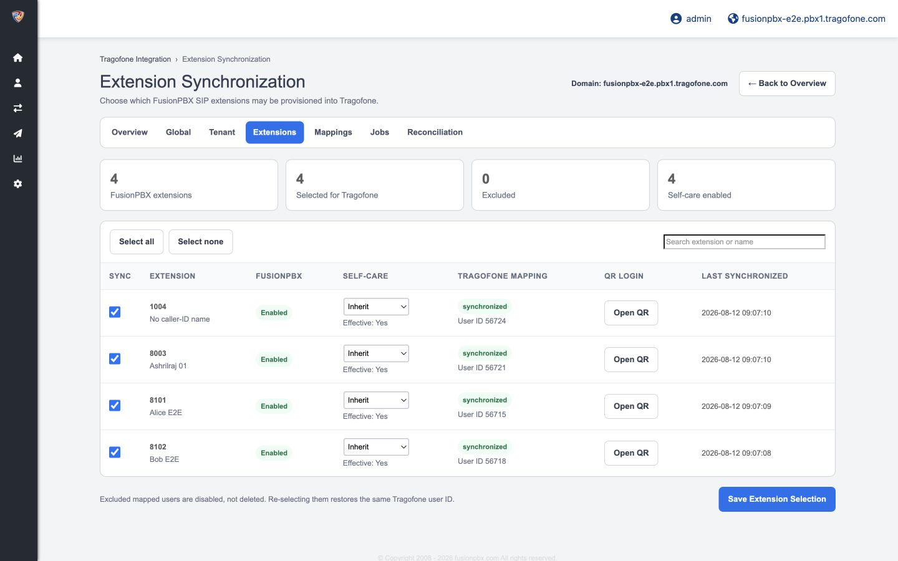
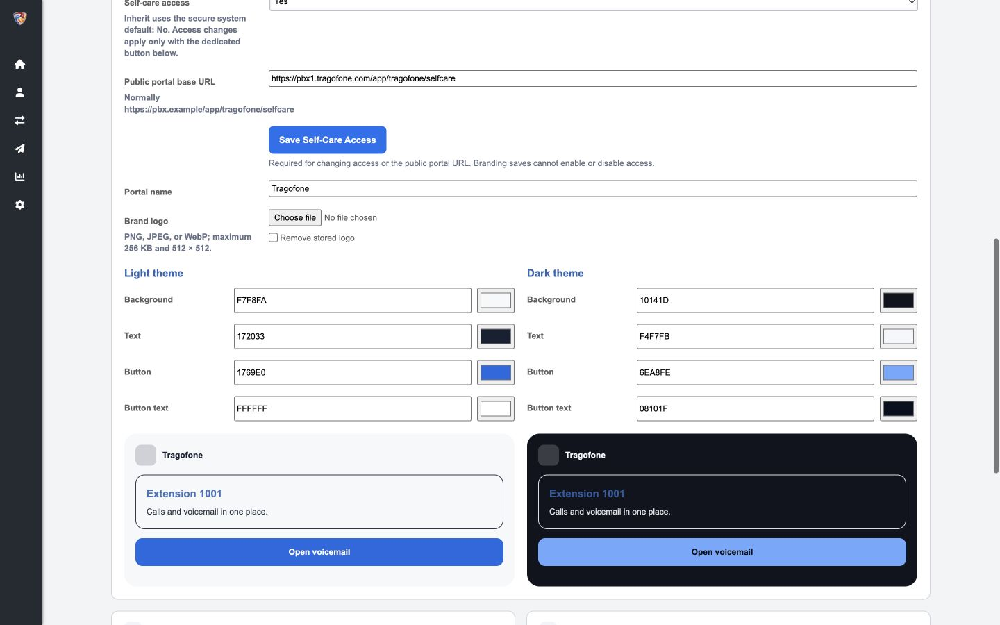
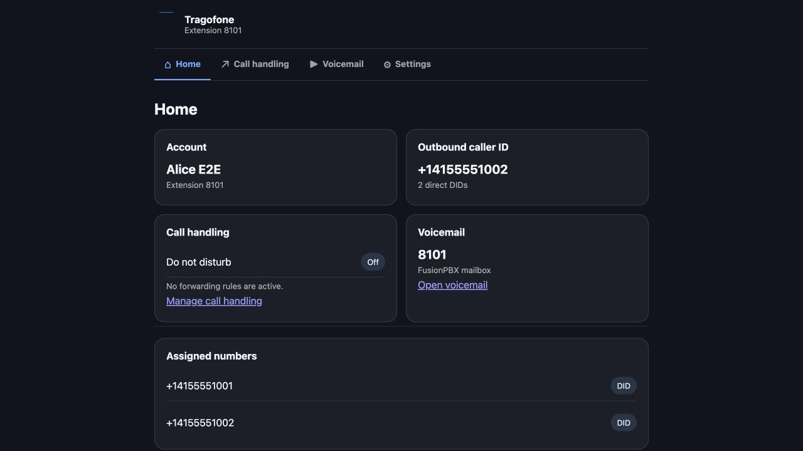
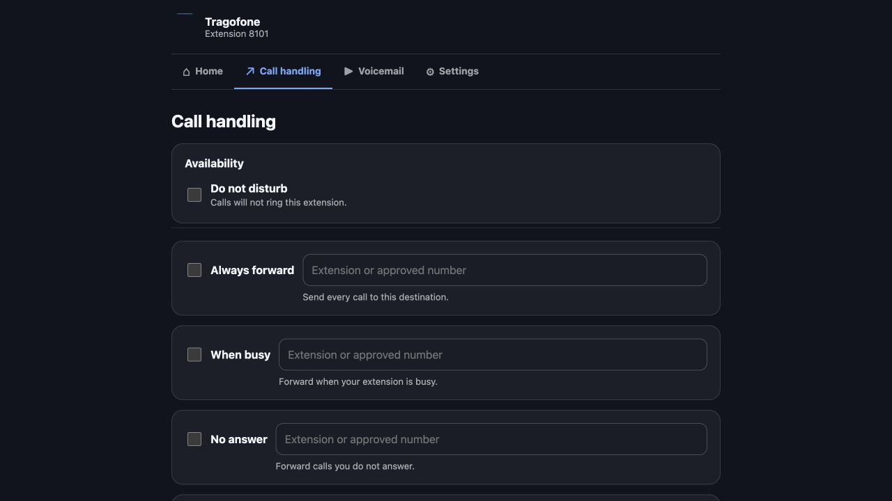
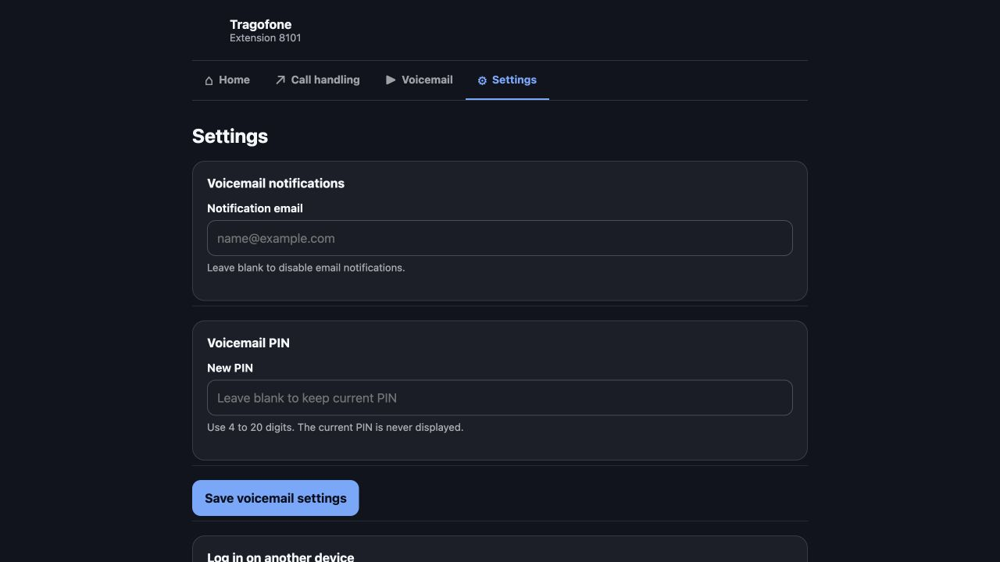

# FusionPBX Companion for Tragofone

Native, multi-tenant FusionPBX application for provisioning and operating Tragofone softphone users. FusionPBX remains the source of truth; the companion reads extensions, direct DID assignments, voicemail state, and supported phonebook contacts locally, then synchronizes them through existing Tragofone APIs in the background.

The application works with open-source FusionPBX. It does not require a FusionPBX commercial license, licensed API, core patch, remote database connection, or Tragofone server/client change.

Current package version: **0.2.0 release candidate**. See the exact supported platform and validation boundaries in [Installation](docs/installation.md) and [Validation](docs/validation.md).

## Features

### Multi-tenant administration

- One FusionPBX domain maps to one Tragofone customer.
- Tenant-specific Tragofone URL and company-admin credentials, with explicit inheritance from optional global defaults.
- Expected-customer verification after login prevents credentials from operating against the wrong company.
- Superadmins can manage global defaults and all domains; authorized company administrators remain restricted to their FusionPBX domain.
- Tenant enable, pause/resume, connection test, extension selection, mappings, job inspection, retry, and reconciliation controls.

### SIP user provisioning and lifecycle

- Per-extension include/exclude selection, bulk selection, search, and a tenant default for newly discovered extensions.
- Numeric and alphanumeric extensions containing 2–15 ASCII letters or digits.
- Globally unique Tragofone login `{extension}@{domain}` with the FusionPBX extension retained as the SIP username/authentication ID.
- The current FusionPBX SIP password is also the Tragofone application-login password and is rotated through the existing update APIs.
- Separate user creation and SIP-configuration phases with immediate `extension_uuid → usr_id` persistence to prevent duplicate users.
- Create, update, disable, re-enable, renumber, confirmed delete, and configurable deletion grace-period handling.
- Tragofone application username and user ID remain immutable when a FusionPBX extension number changes; the SIP identity, account name, and displayed mapping are updated.

### Calling configuration and caller ID

- SIP server, port, TLS/TCP/UDP transport, outbound proxy, profile, and voicemail feature code.
- FusionPBX Call Timeout to Tragofone No Answer Timeout.
- FusionPBX Emergency Caller ID Number to Tragofone emergency numbers.
- FusionPBX mailbox Voicemail Enabled state to Tragofone voicemail status.
- Effective Outbound Caller ID is trusted as the primary caller-ID choice.
- Every enabled, unambiguous, directly assigned voice DID is added as an additional caller-ID choice.
- IVRs, queues, ring groups, time conditions, external routes, and ambiguous action chains are never treated as direct DID assignments.

### Restricted Tragofone client policy

- Enables audio calling, dialpad, hold, transfer, local softphone call history, enterprise contacts, and one-touch FusionPBX voicemail (`*97` by default).
- Explicitly disables IM, SMS/MMS, video, Cloud Contacts, BLF, CRM, Zoom, Textable, custom links, auto-answer, call-forwarding UI, and unrelated cloud features.
- Does not synchronize FusionPBX CDRs; call history remains local to the softphone.

### Enterprise phonebook

- Synchronizes supported FusionPBX shared contacts to the tenant-wide Tragofone Enterprise Directory.
- Supports names, organization, title/role, primary email, and enabled mobile/work/extension/other voice numbers.
- Uses immutable `contact_uuid → ed_id` mappings and deletes only records owned by the companion.
- Contact capability/failure isolation keeps SIP and DID synchronization running when contact tables or APIs are unavailable.
- Tragofone Cloud Contacts remain disabled.

### QR enrollment

- Fetches a synchronized user's live Tragofone login QR from FusionPBX.
- Supports secure preview, PBX download, and direct email delivery through configured FusionPBX SMTP.
- Lets an authenticated self-care user display their own QR to enroll another device.
- QR credentials are validated in memory, sent with `no-store`, and never saved in companion tables, jobs, logs, or the FusionPBX email queue.

### Branded self-care portal

- Opens from Tragofone **My Account** without a FusionPBX login while still requiring a valid signed Tragofone launch.
- Global Superadmin-controlled portal name, PNG/JPEG/WebP logo, and WCAG-validated light/dark colors.
- Independent **Inherit / Yes / No** access policy at global, domain, and user levels.
- Responsive Home, Call handling, Voicemail, and Settings views for Tragofone desktop and mobile WebViews.
- Read-only account, extension, effective caller ID, direct DID, mailbox, DND, and forwarding summary.
- Native FusionPBX DND plus unconditional, busy, no-answer, and not-registered forwarding with tenant and external-prefix validation.
- Visual Voicemail listing, playback, byte-range delivery, download, read/unread, transcription display when present, confirmed deletion, and MWI refresh.
- Voicemail notification email and PIN management without exposing the existing PIN.
- Twenty-four-hour default idle and absolute session limits, with immediate revocation when access, user, extension, mapping, or salt state changes.

### Reliable background operation

- Thirty-second scanner, transactional outbox, tenant concurrency, per-entity ordering, and five-minute worker leases.
- Retry schedule of 1, 5, and 15 minutes, then 1, 3, and 6 hours.
- Six-hour full reconciliation, manual tenant reconciliation, and dead-job retry.
- Expired-lock recovery after worker crashes.
- Authentication and identity failures pause only the affected tenant; contact failures do not stop SIP/DID work.
- Sanitized audit history and secret redaction throughout UI, jobs, and logs.

## Screenshots

The images below were captured from the deployed validation environment using non-production test users and numbers.

### FusionPBX extension synchronization



### Global self-care branding



### Self-care home



### Self-care call handling



### Self-care settings



## Supported platform

| Component | Supported target |
|---|---|
| FusionPBX | 5.5 series; integration-tested with 5.5.12 |
| PHP | 8.1–8.3; PHP 8.3 is the preferred production target |
| Database | The PostgreSQL database used by FusionPBX |
| Operating system | Linux with systemd and the standard FusionPBX filesystem layout |
| Required PHP extensions | cURL, Fileinfo, GD, JSON, mbstring, PDO/PostgreSQL, and Sodium |

FusionPBX 5.4 and older, PHP 8.4/8.5, FreeBSD, and non-systemd deployments are not supported until the complete integration matrix is repeated for those targets.

## Installation and configuration

1. Review [Installation](docs/installation.md) and confirm the exact platform requirements.
2. Install the native app and systemd services using the supplied installer.
3. Sign out and back into FusionPBX, then open **Advanced → Tragofone Integration**.
4. Configure global defaults if needed, configure each tenant, test the Tragofone identity, and select extensions.
5. Run reconciliation and verify mappings, jobs, SIP registration, DID choices, phonebook records, QR enrollment, and self-care.

Use the [User manual](docs/user-manual.md) for the complete Superadmin and company-administrator workflows.

## Documentation

- [Installation and compatibility](docs/installation.md)
- [Configuration reference](docs/configuration.md)
- [Superadmin and company-admin user manual](docs/user-manual.md)
- [Supported and unsupported features](docs/supported-features.md)
- [Self-care portal](docs/selfcare.md)
- [Architecture and data ownership](docs/architecture.md)
- [How synchronization works](docs/how-it-works.md)
- [DID and caller-ID behavior](docs/did-caller-id.md)
- [Enterprise phonebook behavior](docs/contact-sync.md)
- [Tragofone API contract](docs/tragofone-api-contract.md)
- [Security](docs/security.md)
- [Troubleshooting](docs/troubleshooting.md)
- [Validation matrix](docs/validation.md)
- [Upgrading](docs/upgrading.md)
- [Uninstalling](docs/uninstall.md)
- [Development and release process](docs/development.md)

## Important boundaries

- Enterprise phonebook synchronization requires the supported FusionPBX contact tables.
- QR email delivery requires working FusionPBX SMTP/mail transport.
- Visual Voicemail requires the supported FusionPBX voicemail schema and readable media storage.
- Tenant-specific self-care branding, FusionPBX CDR synchronization, server recordings, voicemail greeting management, native Tragofone Visual Voicemail, and bidirectional FusionPBX administration are not included.
- Effective Outbound Caller ID is trusted from FusionPBX; administrators and carriers remain responsible for caller-ID authorization and anti-spoofing controls.
- Production activation should follow the deployment's normal backup, change-control, acceptance-test, security-review, and rollback procedures.

## Development

```bash
composer install
composer lint
composer test
```

CI runs syntax checks and 108 automated tests with 414 assertions on PHP 8.1, 8.2, and 8.3.

## License

Copyright 2026 Trago Communications Pvt Ltd. Licensed under the [Apache License 2.0](LICENSE). You may use, modify, and distribute this software subject to the license terms. Tragofone and other product names or marks remain the property of their respective owners.
