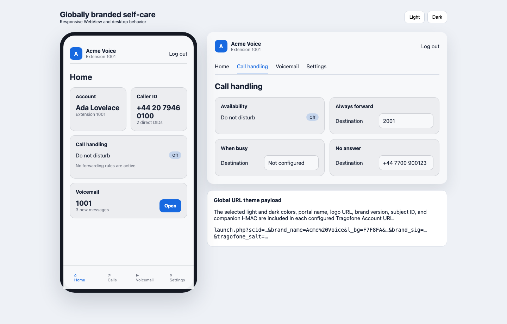

# FusionPBX Companion for Tragofone

Private, native FusionPBX application for tenant-aware Tragofone provisioning. It reads FusionPBX extensions, direct DID assignments, and supported contacts locally, then calls existing Tragofone APIs asynchronously.

## MVP capabilities

- Per-domain Tragofone credentials with explicit global inheritance
- Role-aware UI: Superadmins and tenant-scoped admins can open the module; Global Settings remain Superadmin-only
- Customer identity verification and tenant-isolated tokens
- SIP user creation and configuration using existing CRUD APIs
- FusionPBX call timeout, emergency caller ID, and voicemail-enabled state synchronization
- Numeric and alphanumeric SIP extensions with Tragofone's 2–15 character validation boundary
- Per-extension include/exclude controls with a tenant default for newly created extensions
- Effective outbound caller ID plus multiple direct DID choices with deterministic ordering
- Restricted client policy: audio calling, dialpad, local history, enterprise phonebook, and one-touch voicemail
- Transactional job outbox, retries, reconciliation, and deletion grace period
- In-GUI reconciliation and failed-job retry controls
- Crash recovery for expired worker locks and automatic tenant pause on authentication/identity failures
- FusionPBX phonebook synchronization to the tenant-wide Tragofone Enterprise Directory
- Globally branded, signed Tragofone My Account portal with responsive light/dark themes
- Inherit/Yes/No self-care access policy at global, domain, and individual-user levels
- Extension-scoped DND, call forwarding, Visual Voicemail, voicemail email, and PIN self-care

No FusionPBX licensed API, remote database access, FusionPBX core patch, or Tragofone server change is required.

## Phase 2 self-care

The Superadmin configures one global portal name, logo, and light/dark color set. The worker signs those raw values into each eligible user's Tragofone Account URL. A one-time Tragofone salt launch creates a short server-side session; users never receive a FusionPBX login or access another extension's data.



See [Self-care portal](docs/selfcare.md) and the [interactive mockup](docs/mockups/selfcare.html).

## Quick start

See [Installation](docs/installation.md) for the explicit FusionPBX/PHP compatibility matrix and verified installation procedure, then [Configuration](docs/configuration.md). Superadmins and company administrators should use the [User manual](docs/user-manual.md) for daily operation. The current supported FusionPBX target is the 5.5 series; the project remains an MVP and must be validated against the exact target environment before production rollout.

## Documentation

- [Architecture](docs/architecture.md)
- [User manual](docs/user-manual.md)
- [How it works](docs/how-it-works.md)
- [Supported features](docs/supported-features.md)
- [Tragofone API contract](docs/tragofone-api-contract.md)
- [Security](docs/security.md)
- [Troubleshooting](docs/troubleshooting.md)
- [Validation matrix](docs/validation.md)
- [Self-care portal](docs/selfcare.md)

## Development

```bash
composer install
composer test
composer lint
```

Copyright (c) 2026 Ecosmob Technologies. All rights reserved.
